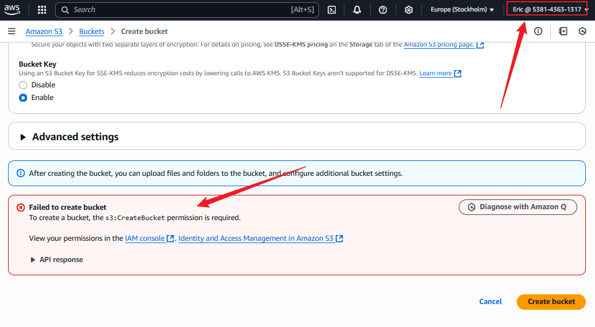
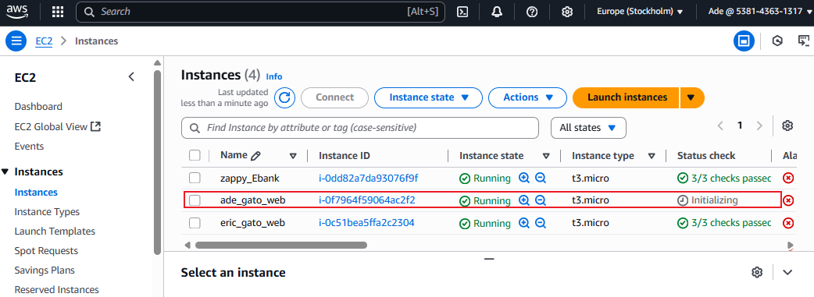

# AWS IAM Project: Access Control for GatoGrowFast.com

## 📘 Project Overview

This project demonstrates how to apply AWS Identity and Access Management (IAM) principles by configuring access for employees of GatoGrowFast.com. The goal is to enforce secure access to AWS services such as EC2 and S3 through IAM users, groups, and policies.

## 🎯 Objectives

- Understand IAM concepts such as users, groups, roles, and policies.
- Create and attach IAM policies for specific AWS services.
- Implement fine-grained access control based on employee roles.
- Verify IAM configurations through real-world access testing.
- Reflect on IAM challenges, limitations, and security best practices.


## 🧩 Scenario Summary

GatoGrowFast.com, a growth marketing consultancy, wants to securely manage AWS access for the following employees:

- **Eric**: Needs full access to EC2 only.
- **Jack & Ade**: Need full access to both EC2 and S3 services.


## 🔧 Part 1: IAM Policy and Access for Eric

### ✅ Steps

1. **Created a custom IAM policy** named `EC2FullAccess-Gato` with JSON allowing full EC2 access:
   ```json
   {
     "Version": "2012-10-17",
     "Statement": [
       {
         "Effect": "Allow",
         "Action": "ec2:*",
         "Resource": "*"
       }
     ]
   }
   ```
   
   2. Created IAM user Eric with programmatic and console access.
   3. Attached the EC2-only policy directly to Eric.

## 🔧 Part 2: Group Setup and Policy for Jack & Ade

1. Created IAM policy EC2S3FullAccess-Gato to grant full EC2 and S3 access
2. Created a group named Development-Team and attached the EC2+S3 policy.
3. Created IAM users Jack and Ade and added them to the group

## 🔍 Part 3: User Access Verification and Policy Enforcement

### ✅ Eric (EC2-Only)
Tested Allowed Access:

Logged in and successfully launched EC2 instance.

Tested Denied Access:

Attempted to open S3 → received "Access Denied" error.

### ✅ Jack & Ade (EC2 + S3 Access)
Tested Allowed Access:

Launched EC2 instance

Created and listed S3 buckets

Tested Denied Access:

Tried accessing IAM and Billing → received "Not authorized" errors

## Enabled MFA for IAM Users
Enabled Multi-Factor Authentication (MFA) for all users.
Used virtual MFA apps (e.g., Google Authenticator).

##  Reflections and Challenges
🔐 IAM Insights
IAM is the backbone of AWS security, enabling fine-grained access to AWS services.

Policies control access on a least privilege basis — even small omissions cause access failures.

⚠️ Practical Challenges
Access Denied Testing:
Errors like "Access Denied" helped confirm correct permission boundaries. Without testing, misconfigurations may go unnoticed.

Policy Granularity:
Missing permissions such as "s3:ListAllMyBuckets" cause denial, even with "s3:*" in some scenarios — understanding Action + Resource pairing is key.

Group vs User Policy:
Managing access via groups (for Jack & Ade) was more scalable than individual policy attachment (Eric), especially for growing teams.

IAM UI Navigation:
Navigating AWS IAM UI efficiently and filtering/searching for policies or users was important to avoid configuration mistakes.

Testing Across Services:
Attempting access outside user scope (IAM, Billing) was useful in understanding AWS default-deny behavior.

## ✅ Conclusion
This project successfully demonstrated the creation, assignment, and testing of IAM policies for individual users and groups. Verification steps confirmed real access boundaries and highlighted the importance of precision and testing in IAM configuration.

## Below are screenshots of workflow:








